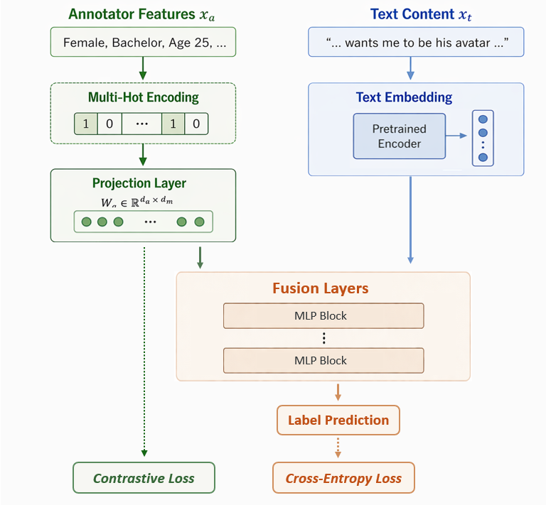

## Modeling Human Perspectives with Socio-Demographic Representations

<div align="center",style="font-family: charter;">
  Authors:  <a href="https://scholar.google.com/citations?user=dTRy2gUAAAAJ&hl=en" target="_blank">Leixin Zhang</a>, 
    <a href="https://coltekin.net/cagri/" target="_blank">Çağrı Çöltekin</a>
</div>


####
####
#### 🔥 **Paper Accepted at ACL 2026 Findings** 

**Background:** 
- Modeling annotator perspectives and understanding their relationship with other human factors, such as socio-demographic attributes, have received increasing attention.
- Prior work typically focuses on single demographic factors or limited combinations.
- However, in real-world settings, **annotator perspectives are shaped by complex social contexts**, and finer-grained socio-demographic attributes can better explain human perspectives.

**🏆 Our Contribution:** We propose **Socio-Contrastive Learning**: a method that jointly models annotator perspectives while learning socio-demographic representations from a set of socio-demographic features. 

**🏆 Advantages:** 
1. An effective approach for the fusion of socio-demographic features and textual representations to predict annotator perspectives. 
2. The learned representations further enable analysis and visualization of how demographic factors relate to variation in annotator perspectives.
 


## 🧱 Code Structure
```
Socio_Contrastive_Learning
│
├── data_processing/
│   ├── hatespeech_data_processing.py
│   ├── toxicity_data_processing.py
│   ├── dataset_loader.py
│   └── text_encoder.py
│
├── models/
│   ├── baseline_model.py
│   ├── socio_feature_model.py
│   └── contrastive_model.py
│
├── training/
│   ├── self_defined_loss.py
│   ├── trainer_classes.py
│   └── train_models.py
│
├── evaluation/  
│   └── evaluators.py
│   
└── run_all_models.py
```

## 🌱 Model Architecture

- Model input consists of **two components**: a **multi-hot encoding** of the annotator’s socio-demographic attributes and a **text representation** encoded by a pretrained model.
- **Socio-Contrastive Learning**: Before concatenation, the multi-hot socio-demographic vector is projected into a learnable space. To amplify the most informative socio-demographic attributes, we apply contrastive learning to refine socio-demographic representations based on annotation similarity, encouraging representations to be closer for annotators with similar annotation patterns and farther apart otherwise.
- **Perspective Modeling**: The primary task of the model is to predict each annotator’s label, using a cross-entropy loss. 



## 📦 Datasets

- **Hate Speech Dataset**: Available on Hugging Face  
  👉 `ucberkeley-dlab/measuring-hate-speech`  
  🔗 https://huggingface.co/datasets/ucberkeley-dlab/measuring-hate-speech  

- **Toxicity Dataset**: Available from Stanford ESRG  
  🔗 https://data.esrg.stanford.edu/study/toxicity-perspectives  

> ⚠️ Note: Please ensure that you obtain the access of toxic dataset before using it for model training.

## 💡 Visualization: 

**Annotator Representation for the Hate Speech Dataset**


**Annotator Representation for the Toxic Dataset**


