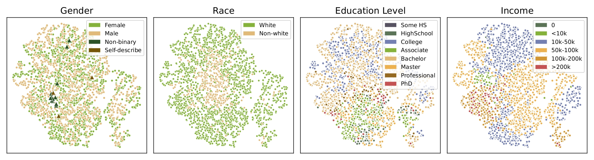
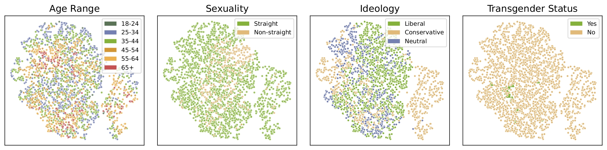
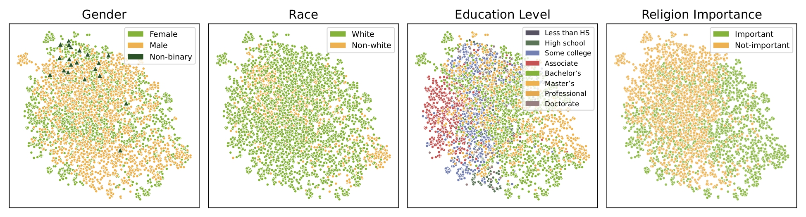
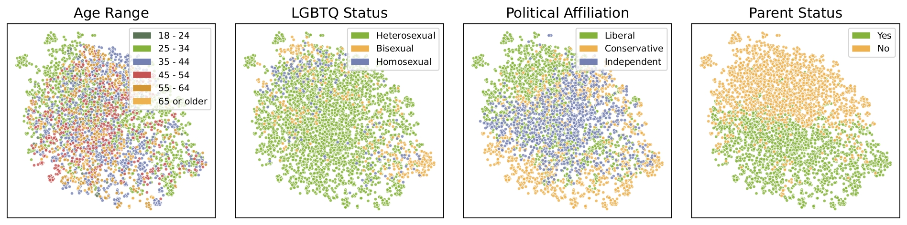

## Modeling Human Perspectives with Socio-Demographic Representations

<div align="center",style="font-family: charter;">
  Authors:  <a href="https://scholar.google.com/citations?user=dTRy2gUAAAAJ&hl=en" target="_blank">Leixin Zhang</a>, 
    <a href="https://coltekin.net/cagri/" target="_blank">Çağrı Çöltekin</a>
</div>


#### 🔥 **Paper Accepted at ACL 2026 Findings** 

**Contribution:** 🏆 Socio-Contrastive Learning 🏆: a method that jointly models annotator perspectives while learning socio-demographic representations from a set of socio-demographic features. 

**Advantages:** 
1. An effective approach for the fusion of socio-demographic features and textual representations to predict annotator perspectives. 
2. The learned representations further enable analysis and visualization of how demographic factors relate to variation in annotator perspectives.

## Code Structure for the Project:
```
Socio_Contrastive_Learning
│
├── data_processing/
│   ├── hatespeech_data_processing.py
│   ├── toxicity_data_processing.py
│   ├── dataset_loader.py
│   └── text_encoder.py
│
├── models/
│   ├── baseline_model.py
│   ├── socio_feature_model.py
│   └── contrastive_model.py
│
├── training/
│   ├── self_defined_loss.py
│   ├── trainer_classes.py
│   └── train_models.py
│
├── evaluation/  
│   └── evaluators.py
│   
└── run_all_models.py
```

## 📦 Datasets

- **Hate Speech Dataset**: Available on Hugging Face  
  👉 `ucberkeley-dlab/measuring-hate-speech`  
  🔗 https://huggingface.co/datasets/ucberkeley-dlab/measuring-hate-speech  

- **Toxicity Dataset**: Available from Stanford ESRG  
  🔗 https://data.esrg.stanford.edu/study/toxicity-perspectives  

> ⚠️ Note: Please ensure that you comply with the dataset licensing agreements and check access before using the data for model training.

## 💡 Visualization: 

**Annotator Representation for the Hate Speech Dataset**


**Annotator Representation for the Toxic Dataset**


